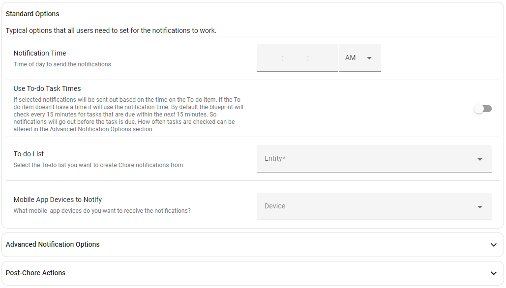

# 🔔 To-do List Chore Notifications
[](https://my.home-assistant.io/redirect/blueprint_import/?blueprint_url=https%3A%2F%2Fgithub.com%2Fbirdwing%2FHA_Blueprints%2Fblob%2Fmain%2Fautomations%2Fto-do_chore_notifications%2Fto-do_chore_notifications.yaml)


## 📓 Description

### Create Actionable Notifications from a Home Assistant To-do List!
This blueprint does not use *Wait* triggers, so that means that all notification actions **will still work even after Home Assistant is restarted**!

Notifications are sent every day at the time you specify in Notification Time or at the time a to-do item is due. See the [Setup Notification Times](#-setup-notification-times) section below for details.
Notifications are sent to every device you specify in *Devices to Notify*. It will generate 1 notification for each passed due item, with the ability to mark the item as completed right from the notification!

### When a Task is Marked Complete (from the notification):
- The notifications will be **cleared from all devices it was sent to**!  
  This way, if a task is marked as done noone has a notification telling them to complete it.
- Through the **When chore is completed** actions you can specify any actions you would like to happen after a task is marked as done.

[View Some Example Use Cases](#-post-chore-actions---custom-actions-after-task-is-marked-done)

## ⌚ Setup Notification Times
There are two options for how notifications are sent out:
1. If *Use To-do Task Times* is toggled **off** then notifications are sent every day at the time you specify in *Notification Time*. the blueprint will generate 1 notification for each item due today or on a previous day.  
If an item doesn't have a due date, it will go out every day at the *Notification Time*.
2. If *Use To-do Task Times* is toggled **on** the blueprint will generate 1 notification for each item **at the time the item is due**, for any item due today or on a previous day.  
If the to-do item does not have a time or date set then the notification will go out at the specified *Notification Time*.
    - For example. If todays date is **January 2nd** here is a list of to-do item due dates and times and when you will receive them:
      - **No Date or Time** - Notification will be sent out at the *Notification Time*
      - **January 1st** - Notification will be sent out at the *Notification Time*
      - **January 1st @ 1:00PM** - Notification will be sent out at 1:00PM
      - **January 2nd** - Notification will be sent out at the *Notification Time*
      - ** January 2nd @ 2:16PM** - Notification will be sent out at 2:15PM (See note below about this).
      - ** January 3rd @1:00PM** - Notification will *not* be sent out today because it is not due until tomorrow.
>[!NOTE]
> By default To-do items are checked every 15 minutes. This is why in the example above the item due at **2:16PM** was sent out at 2:15PM.  
> It checks every 15 minutes and creates notifications for any item that is due before the next time it checks. So items are sent out *before* they are due rather than after they are due in these cases.  
> How often tasks are checked can be altered in the Advanced Notification Options section by updating the *Time Check Frequency* setting.  
> **Use Caution** checking too often can put a strain on your system, especially if you have large To-do lists. If you have a large To-do list and are having issues, try setting it to a higher value.

## 📗 F.A.Q

### 1. What to-do / task tracking integrations work with this Blueprint?
Any integration that makes use of Home Assistants [To-do entities](https://www.home-assistant.io/integrations/todo) should work with this blueprint.
Integrations I have tested myself are:
- Home Assistants built in [Local To-do](https://www.home-assistant.io/integrations/local_todo/) integration.
- [Google Tasks](https://www.home-assistant.io/integrations/google_tasks/)
  - Google Tasks has the advantage of being able to create recurring tasks that will automatically "uncheck" themselves and update their due date after they are marked done.

### 2. What notify services work with this Blueprint?
Although this blueprint was designed to work *the easiest* with the notification services provided by the Home Assistant [Companion App](https://companion.home-assistant.io/), for both Android and IOS, 
it can also work with [Notify Groups](https://www.home-assistant.io/integrations/group/#notify-groups) and other notifiers. Seting up the groups or other notifiers can be done in the **Advanced Notification Options** 
section when setting up the blueprint.
>[!IMPORTANT]
> In order for the notifier to work the action must be notify.*name_of_notifier*. It does not work with the *notify.send_message* action.

### 3. IOS Notifications aren't showing the "Mark Done!" notification action, whats wrong?
Apple devices running IOS do not show the notification actions automatically. On IOS you must *tap and hold* on the notification then the "Mark Done!" action will be displayed.
Simply tapping on the notification, or swipping it away will *not* mark the task as done.
This is a limitation of IOS, and there is no way to change this functionality.
> [!TIP]
> If this is an issue I recommend putting a note in the task name or description, on each to-do list item, to remind you to tap and hold on the notification in order to mark it as done.

## 📃 *Post-Chore Actions* - Custom Actions After Task is Marked Done
> [!IMPORTANT]
> These actions will only run *if the task was marked done through the notification*!
> If the task is marked done directly through the Home Assistant To-do list screen, or from the integration screen these actions will not run.

### Example Use Cases:
> [!TIP]
> A variable named **todo_item** is created when a task/chore is marked complete, this can be used within your custom actions along with Home Assistants [Chose](https://www.home-assistant.io/docs/scripts/#choose-a-group-of-actions)
> action and [Template Condition](https://www.home-assistant.io/docs/scripts/conditions/#template-condition) to specify different actions for each task/chore.

#### 1. Use a Counter Helper to Keep Track of an Item in Stock
If you have a task/chore that requires having something in stock, such as Air filters or Chlorine Tablets, you can create a Home Assistant [Counter Helper](https://www.home-assistant.io/integrations/counter/)
to keep track of how much you have in stock.
Then when your "Replace Air Conditioner Tablets" task/chore is marked complete on your to-do list, you can call the [counter.decrement](https://www.home-assistant.io/integrations/counter/#service-counterdecrement) service
for that Counter Helper to automatically update how much is left in stock.

*Yaml put into the "When chore is completed" blueprint input.*
```yaml
choose:
  - conditions:
      - condition: template
        value_template: "{{ todo_item == 'Replace Air Conditioner Tablets' }}"
        alias: "Make sure name is: Replace Air Conditioner Tablets"
    sequence:
      - service: counter.decrement
        target:
          entity_id: counter.ac_tablets_in_stock
        data: {}
```
The important part is the *template condition's* **value_template** where we compare the **todo_item** variable, which is the task/chore that was just marked done, with the name of the chore we want to perform that specific action for:
```yaml
value_template: "{{ todo_item == 'Replace Air Conditioner Tablets' }}"
```
